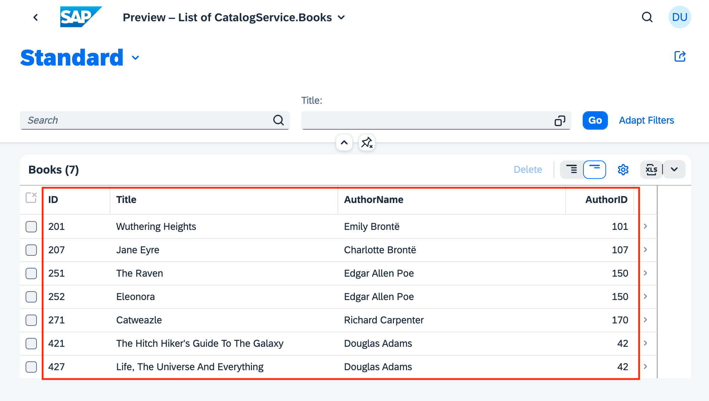
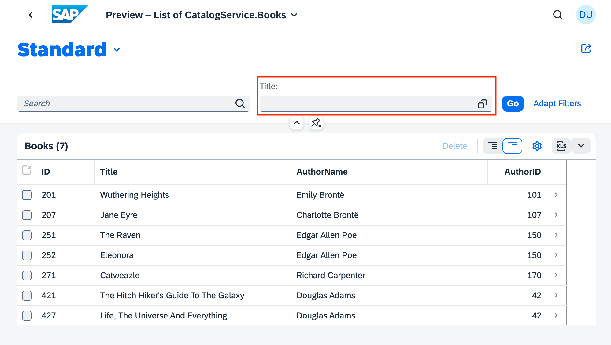
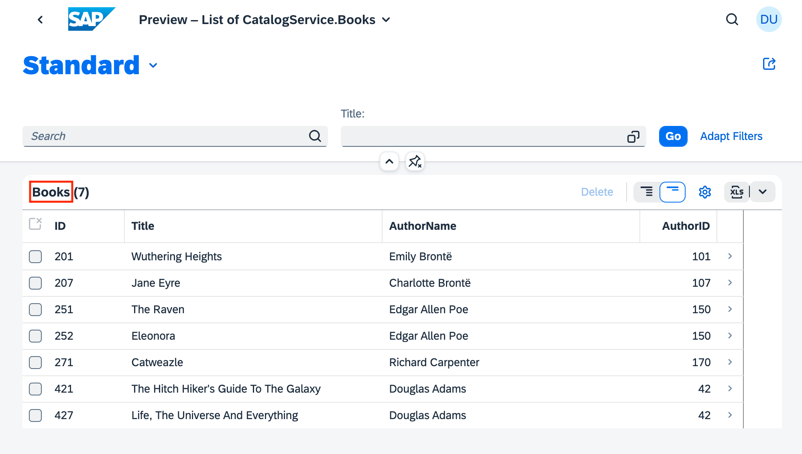
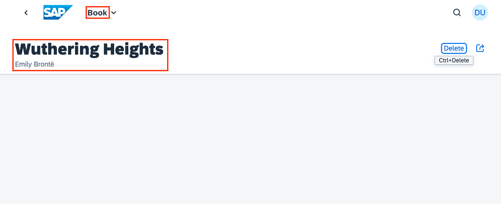

# Exploring annotations

This document is an exploration of annotations, in CDS and in OData, and how they work together.

To accompany the document, we'll use a simple app. The specific app we'll use is the one that is built over the series of exercises in the (now archived) [repo for the SAP CodeJam on CAP with Node.js](https://github.com/SAP-archive/cloud-cap-nodejs-codejam). It is included in this repo as it is a good illustration of some basic annotations. In particular, we will examine the annotations in the [index.cds](srv/index.cds) and [service.cds](srv/service.cds) files in the [srv/](srv/) directory.

## Getting things running

Move to this directory and start up the app (and the corresponding backend services), like this:

```bash
cd workingapp
cds run
```

## The annotations

This section is fairly long, and is a journey through annotations in the service layer of the CAP application in this directory. There are the following sections:

* We start here with a brief introduction to annotations in CAP and CDS.

* Then we look at a singular annotation [in service.cds](#in-servicecds).

* After that, we take a look at a more complex set of annotations [in index.cds](#in-indexcds), with an exploration of [OData annotation vocabularies](#odata-annotation-vocabularies) in general, a specific look at one particular vocabulary ([the UI annotation vocabulary](#the-ui-annotation-vocabulary), a brief overview of the [syntax for annotations in CDS](#syntax-for-annotations-in-cds), a deep dive into [annotation values](#annotation-values) (primitives, collections and records), how to [express multiple annotations in CDS](#expressing-multiple-annotations-with-), rounding off this branch of exploration with an examination of [annotation vocabulary references](#annotation-vocabulary-references).

* After that exploration of theory, we're ready for [interpreting the annotation details](#interpreting-the-detailed-annotations), wherein we [look at the DataFieldAbstract type](#looking-at-the-datafieldabstract-type), the [UI.Identification term](#the-uiidentification-term), [the UI.LineItem term](#the-uilineitem-term), [the UI.SelectionFields term](##the-uiselectionfields-term) and [the UI.HeaderInfo term](#the-uiheaderinfo-term), all of which are used in the annotations in `index.cds`.

* Finally, we turn to the OData metadata document, and take some time [examining the OData annotations in EDMX](#examining-the-odata-annotations-in-edmx), paying close attention to [namespace references](#namespace-references) and then [annotation targets](#annotation-targets), before moving on to look at the actual EDMX generated for the annotations used - the [UI.Identification annotation](#uiidentification-annotation), the [UI.SelectionFields annotation](#uiselectionfields-annotation), the [UI.LineItem annotation](#uilineitem-annotation) and the [UI.HeaderInfo annotation](#uiheaderinfo-annotation). To put everything into context, [the CatalogService's metadata](#the-catalogservices-metadata) is shown in its entirety.


Here's a brief overview of the annotations used in the service layer, which is part of this app. Note that the word "annotation" is used in two different contexts here:

- [Annotations in CAP](https://cap.cloud.sap/docs/cds/annotations) in CDS form are used to describe and augment core data service definitions, and are prefixed with the `@` symbol
- [OData annotations](http://docs.oasis-open.org/odata/odata-vocabularies/v4.0/odata-vocabularies-v4.0.html), organised into [vocabularies](https://github.com/oasis-tcs/odata-vocabularies), that provide extra information on an OData service's metadata and appear in the EDMX definition (in the `$metadata` document)

When used in an OData context (i.e. when describing an OData service in CDS) the CAP annotations will result in valid OData annotations. These annotations will belong to either standard OData vocabularies, or SAP specific vocabularies.

> Note that "A service MUST NOT require the client to understand custom annotations in order to accurately interpret a response" (see the [Vocabulary Extensibility section of OData Version 4.0. Part 1: Protocol Plus Errata 03](http://docs.oasis-open.org/odata/odata/v4.0/errata03/os/complete/part1-protocol/odata-v4.0-errata03-os-part1-protocol-complete.html#_Toc453752215)). In other words, beyond annotations in the "Core" vocabulary, think of further annotations as suggestions.

### In service.cds

CDS annotation: `@readonly`

Used at the entity level, this CDS annotation generates specific terms in the [OData "Capabilities" vocabulary](http://docs.oasis-open.org/odata/odata-vocabularies/v4.0/csprd01/odata-vocabularies-v4.0-csprd01.html#_Toc472083030).

Specifically, this line:

`@readonly entity OrderInfo as projection on my.Orders ...`

causes these OData annotation terms to be generated and included in the service metadata document: `DeleteRestrictions`, `InsertRestrictions` and `UpdateRestrictions`.

You can see this for yourself using the `cds` command line tool to generate EDMX for the `Stats` service defined within the [srv/service.cds](srv/service.cds) file, which looks like this:

```cds
using my.bookshop as my from '../db/schema';

// ...

service Stats {
  @readonly entity OrderInfo as projection on my.Orders excluding {
    createdAt,
    createdBy,
    modifiedAt,
    modifiedBy,
    book,
    country
  }
}
```

This is how you do it:

```bash
cds compile srv --service Stats --to edmx-v4
```

This produces the following output - note the `<Annotations>` element:

```xml
<?xml version="1.0" encoding="utf-8"?>
<edmx:Edmx Version="4.0" xmlns:edmx="http://docs.oasis-open.org/odata/ns/edmx">
  <edmx:Reference Uri="https://oasis-tcs.github.io/odata-vocabularies/vocabularies/Org.OData.Capabilities.V1.xml">
    <edmx:Include Alias="Capabilities" Namespace="Org.OData.Capabilities.V1"/>
  </edmx:Reference>
  <edmx:DataServices>
    <Schema Namespace="Stats" xmlns="http://docs.oasis-open.org/odata/ns/edm">
      <EntityContainer Name="EntityContainer">
        <EntitySet Name="OrderInfo" EntityType="Stats.OrderInfo"/>
      </EntityContainer>
      <EntityType Name="OrderInfo">
        <Key>
          <PropertyRef Name="ID"/>
        </Key>
        <Property Name="ID" Type="Edm.Guid" Nullable="false"/>
        <Property Name="quantity" Type="Edm.Int32"/>
      </EntityType>
      <Annotations Target="Stats.EntityContainer/OrderInfo">
        <Annotation Term="Capabilities.DeleteRestrictions">
          <Record Type="Capabilities.DeleteRestrictionsType">
            <PropertyValue Property="Deletable" Bool="false"/>
          </Record>
        </Annotation>
        <Annotation Term="Capabilities.InsertRestrictions">
          <Record Type="Capabilities.InsertRestrictionsType">
            <PropertyValue Property="Insertable" Bool="false"/>
          </Record>
        </Annotation>
        <Annotation Term="Capabilities.UpdateRestrictions">
          <Record Type="Capabilities.UpdateRestrictionsType">
            <PropertyValue Property="Updatable" Bool="false"/>
          </Record>
        </Annotation>
      </Annotations>
    </Schema>
  </edmx:DataServices>
</edmx:Edmx>
```

These annotation terms basically say - to those consuming apps that can interpret them - that delete, insert or update operations may not be performed on the `OrderInfo` entity.

In case you're wondering - these restrictions that are imposed via the `@readonly` decoration in the CDS definition are actually implemented in CAP.

Assuming that the service is running (with `cds run`) you can try this yourself, like this:

```bash
curl
  --silent \
  --header 'Content-Type: application/json' \
  --include \
  --data '{"quantity": 10}' \
  --url 'http://localhost:4004/stats/OrderInfo'
```

This produces the following:

```
HTTP/1.1 405 Method Not Allowed
X-Powered-By: Express
x-correlation-id: 3a80f986-2acd-4663-8116-d9b39d532f31
OData-Version: 4.0
content-type: application/json;odata.metadata=minimal
Date: Thu, 07 Jul 2022 10:57:04 GMT
Connection: keep-alive
Keep-Alive: timeout=5
Content-Length: 104

{"error":{"code":"405","message":"Entity \"Stats.OrderInfo\" is read-only","@Common.numericSeverity":4}}
```

Nice!

### In index.cds

In this file, [srv/index.cds](srv/index.cds), you can see the explicit [annotate](https://cap.cloud.sap/docs/cds/cdl#annotate) directive in action. This is contrast to the previous example, where the `@readonly` annotation was specified directly with the definition of what was being annotated.

(There's a parallel here to a feature of OData annotations, and how they're served. In a similar way to how annotations in CDS can be either alongside, or separate from, the data definitions they're describing, so also can OData annotations be served in the same EDMX document (the OData service's metadata document) or as a separate resource. Not anything earth shatteringly important, but worth mentioning here.)

```cds
annotate CatalogService.Books with @(
    UI: {
        Identification: [ {Value: title} ],
        SelectionFields: [ title ],
        LineItem: [
            {Value: ID},
            {Value: title},
            {Value: author.name},
            {Value: author_ID},
            {Value: stock}
        ],
        HeaderInfo: {
            TypeName: '{i18n>Book}',
            TypeNamePlural: '{i18n>Books}',
            Title: {Value: title},
            Description: {Value: author.name}
        }
    }
);
```

This example is considerably more involved than the `@readonly` example previously. Let's take it bit by bit. You may also want to refer to the [OData Annotations section of the CAP documentation](https://cap.cloud.sap/docs/advanced/odata#annotations).

#### OData annotation vocabularies

First, let's consider the simple and single word "readonly", and then what appears to be words ("UI", "Identification", "LineItem", "Value", etc) within a wider syntactical structure in this larger example.

The previous `@readonly` example was a CDS annotation that resulted in the generation of multiple OData annotations.

In this current example, what we're looking at are annotations that are closer to the direct use of the combination of the OData annotation concepts of "vocabulary" and "term". To understand this better, let's start by taking a step back, and staring at the OData annotation vocabularies for a few minutes.

Put simply, OData annotations are expressed in the form of terms, which are grouped together into vocabularies.

The standards document [OData Vocabularies Version 4.0 Committee Specification / Public Review Draft 01](http://docs.oasis-open.org/odata/odata-vocabularies/v4.0/odata-vocabularies-v4.0.html) outlines six vocabularies as follows (the summary document [OData specs](https://github.com/qmacro/odata-specs/blob/master/overview.md) provides some information on the different document stages such as "Committee Specification" and "Public Review"):

|Vocabulary|Namespace|Description|
|-|-|-|
|Core|[Org.OData.Core.V1](https://github.com/oasis-tcs/odata-vocabularies/blob/main/vocabularies/Org.OData.Core.V1.md)|Terms describing behavioral aspects along with annotation terms that can be used to define other vocabularies (yes, meta all the things!)|
|Capabilities|[Org.OData.Capabilities.V1](https://github.com/oasis-tcs/odata-vocabularies/blob/main/vocabularies/Org.OData.Capabilities.V1.md)|Terms that provide a way for service authors to describe certain capabilities of an OData Service|
|Measures|[Org.OData.Measures.V1](https://github.com/oasis-tcs/odata-vocabularies/blob/main/vocabularies/Org.OData.Measures.V1.md)|Terms describing monetary amounts and measured quantities|
|Validation|[Org.OData.Validation.V1](https://github.com/oasis-tcs/odata-vocabularies/blob/main/vocabularies/Org.OData.Validation.V1.md)|Terms describing validation rules|
|Aggregation|[Org.OData.Aggregation.V1](https://github.com/oasis-tcs/odata-vocabularies/blob/main/vocabularies/Org.OData.Aggregation.V1.md)|Terms describing which data in a given entity model can be aggregated, and how|
|Authorization|[Org.OData.Authorization.V1](https://github.com/oasis-tcs/odata-vocabularies/blob/main/vocabularies/Org.OData.Authorization.V1.md)|Terms describing a web authorization flow|

> If you like rabbit holes, note that all the vocabularies are described in machine-readable format ... using terms in the Core vocabulary. [Even the Core vocabulary itself](https://github.com/oasis-tcs/odata-vocabularies/blob/main/vocabularies/Org.OData.Core.V1.xml). Don't forget to come back once you've explored!

In the [Introduction](http://docs.oasis-open.org/odata/odata-vocabularies/v4.0/csprd01/odata-vocabularies-v4.0-csprd01.html#_Toc472083025) section of the standards document, it says that "_Other OData vocabularies may be created, shared, and maintained outside of this work product_".

And so there are other OData annotation vocabularies, for different purposes. SAP has created some, and they are documented publicly in the [SAP/odata-vocabularies](https://github.com/SAP/odata-vocabularies) repository on GitHub. Amongst the SAP vocabularies, there are ones called Analytics, Communication, DataIntegration and also one called [Common](https://github.com/SAP/odata-vocabularies/blob/main/vocabularies/Common.md) which contains terms common for all SAP vocabularies.

#### The UI annotation vocabulary

Another one in that list from SAP is the [UI](https://github.com/SAP/odata-vocabularies/blob/main/vocabularies/UI.md) vocabulary, containing terms relating to presenting data in user interfaces.

Staring at [the table of Terms](https://github.com/SAP/odata-vocabularies/blob/main/vocabularies/UI.md#terms) in this vocabulary (or any for that matter) will help us interpret the CDS in `index.cds` we saw earlier, in other words, this:

```cds
annotate CatalogService.Books with @(...);
```

More specifically it will help us to interpret everything inside the `@(...)`.

Looking at the contents of that table of terms, we see something like this (this excerpt shows just some of the many terms):

Term|Type|Description
:---|:---|:----------
[HeaderInfo](https://github.com/SAP/odata-vocabularies/blob/main/vocabularies/UI.xml#L58:~:text=%3CTerm%20Name=%22-,HeaderInfo,-%22)|[HeaderInfoType?](https://github.com/SAP/odata-vocabularies/blob/main/vocabularies/UI.md#HeaderInfoType)|Information for the header area of an entity representation. HeaderInfo is mandatory for main entity types of the model
[Identification](https://github.com/SAP/odata-vocabularies/blob/main/vocabularies/UI.xml#L109:~:text=%3CTerm%20Name=%22-,Identification,-%22)|\[[DataFieldAbstract](https://github.com/SAP/odata-vocabularies/blob/main/vocabularies/UI.md#DataFieldAbstract)\]|Collection of fields identifying the object
[Badge](https://github.com/SAP/odata-vocabularies/blob/main/vocabularies/UI.xml#L114:~:text=%3CTerm%20Name=%22-,Badge,-%22)|[BadgeType?](https://github.com/SAP/odata-vocabularies/blob/main/vocabularies/UI.md#BadgeType)|Information usually displayed in the form of a business card
[LineItem](https://github.com/SAP/odata-vocabularies/blob/main/vocabularies/UI.xml#L141:~:text=%3CTerm%20Name=%22-,LineItem,-%22)|\[[DataFieldAbstract](https://github.com/SAP/odata-vocabularies/blob/main/vocabularies/UI.md#DataFieldAbstract)\]|Collection of data fields for representation in a table or list
[SelectionFields](https://github.com/SAP/odata-vocabularies/blob/main/vocabularies/UI.xml#L931:~:text=%3CTerm%20Name=%22-,SelectionFields,-%22)|\[PropertyPath\]|Properties that might be relevant for filtering a collection of entities of this type


Note that there are terms, and there are types. A term has a value, which is of a certain type.

In the table we can recognize some of the content that we saw [in index.cds](#in-indexcds) as terms in this UI Vocabulary:

- `Identification`
- `SelectionFields`
- `LineItem`
- `HeaderInfo`

Note in each case, the type is a single (camelcased) word. The word may be wrapped in square brackets, which denotes a collection of values of that type.

In the table exerpt above, most of the single words are also hyperlinked. For example, following [HeaderInfoType](https://github.com/SAP/odata-vocabularies/blob/main/vocabularies/UI.md#HeaderInfoType) leads to a table of properties that belong to that type, i.e. properties that the type consists of - in other words, the type is a structure (called a record, or object, see later).

This is how the `HeaderInfoType` type is described, in terms of the properties within:

Property|Type|Description
:-------|:---|:----------
[TypeName](https://github.com/SAP/odata-vocabularies/blob/main/vocabularies/UI.xml#L63:~:text=<ComplexType%20Name="-,HeaderInfoType,-")|String|Name of the main entity type
[TypeNamePlural](https://github.com/SAP/odata-vocabularies/blob/main/vocabularies/UI.xml#L67:~:text=<ComplexType%20Name="-,HeaderInfoType,-")|String|Plural form of the name of the main entity type
[Title](https://github.com/SAP/odata-vocabularies/blob/main/vocabularies/UI.xml#L71:~:text=<ComplexType%20Name="-,HeaderInfoType,-")|[DataFieldAbstract?](https://github.com/SAP/odata-vocabularies/blob/main/vocabularies/UI.md#DataFieldAbstract)|Title, e.g. for overview pages<br>This can be a DataField and any of its children, or a DataFieldForAnnotation targeting ConnectedFields.
[Description](https://github.com/SAP/odata-vocabularies/blob/main/vocabularies/UI.xml#L81:~:text=<ComplexType%20Name="-,HeaderInfoType,-")|[DataFieldAbstract?](https://github.com/SAP/odata-vocabularies/blob/main/vocabularies/UI.md#DataFieldAbstract)|Description, e.g. for overview pages<br>This can be a DataField and any of its children, or a DataFieldForAnnotation targeting ConnectedFields.
[Image](https://github.com/SAP/odata-vocabularies/blob/main/vocabularies/UI.xml#L91:~:text=<ComplexType%20Name="-,HeaderInfoType,-") *([Experimental](Common.md#Experimental))*|Stream?|Image for an instance of the entity type. If the property has a valid value, it can be used for the visualization of the instance. If it is not available or not valid the value of the property `ImageUrl` can be used instead.
[ImageUrl](https://github.com/SAP/odata-vocabularies/blob/main/vocabularies/UI.xml#L95:~:text=<ComplexType%20Name="-,HeaderInfoType,-")|URL?|Image URL for an instance of the entity type. If the property has a valid value, it can be used for the visualization of the instance. If it is not available or not valid the value of the property `TypeImageUrl` can be used instead.
[TypeImageUrl](https://github.com/SAP/odata-vocabularies/blob/main/vocabularies/UI.xml#L99:~:text=<ComplexType%20Name="-,HeaderInfoType,-")|URL?|Image URL for the entity type
[Initials](https://github.com/SAP/odata-vocabularies/blob/main/vocabularies/UI.xml#L103:~:text=<ComplexType%20Name="-,HeaderInfoType,-") *([Experimental](Common.md#Experimental))*|String?|Latin letters to be used in case no `Image`, `ImageUrl`, or `TypeImageUrl` is present

With this knowledge, we can now understand, for example, that the value for the `HeaderInfo` term is a record of properties including `TypeName`, `TypeNamePlural`, `Title` and so on.

There's one term in the main table of terms excerpt that has a type that is not hyperlinked. The term is `SelectionFields` and the type is `PropertyPath`. That's because that type is not a structure, but a single, scalar thing (also called a primitive). This implies that the value for the `SelectionFields` term is a collection of paths to properties.

> If you're wondering about the `?` suffix on some of the types, ignore it for now - it doesn't help our understanding that we need here.


#### Syntax for annotations in CDS

Another aspect that we need to consider when attempting to parse the annotations above, is CDS's [annotation syntax](https://cap.cloud.sap/docs/cds/cdl#annotation-syntax). For any given term in a vocabulary, the annotation is written as follows:

```cds
@vocabulary.term
```

followed by the value for that annotation.

> There are also [qualified annotations](https://cap.cloud.sap/docs/advanced/odata#qualified-annotations) of which you should be aware, but they're not in play in these examples.

Multiple annotations can be specified in one go by listing them one after another, or, more commonly, by listing them inside a `@(...)` construct and separating them with commas. We can clearly see this in action in our [index.cds](#in-indexcds) example.

#### Annotation values

The final piece in the puzzle to understanding and interpreting annotation definitions and the EDMX content that is generated is the set of different value types for annotation terms. If you're familiar with the core value types in many programming languages, you'll be at home here. There are:

|Value Type|Alternative Name|Example|
|-|-|-|
|Primitive|Scalar|a string, boolean value or number|
|Record|Object|a collection of name value pairs like this: `{ name1: value1, name2: value2, ... }`|
|Collection|Array|a list of other types, either primitives or records, enclosed in `[ ... ]`|

Examples for each of these will help us to get a feel for their general shape.

For these examples, we'll use the most basic of service definitions in CDS, and annotate it as appropriate.

The base definition looks like this:

```cds
service Northwind {

  entity Categories {
    key ID: Integer;
    description: String;
  }
}
```

And the basic EDMX generated from this (see how we did it earlier with the `cds compile` command) is as follows:

```xml
<?xml version="1.0" encoding="utf-8"?>
<edmx:Edmx Version="4.0" xmlns:edmx="http://docs.oasis-open.org/odata/ns/edmx">
  <edmx:DataServices>
    <Schema Namespace="Northwind" xmlns="http://docs.oasis-open.org/odata/ns/edm">
      <EntityContainer Name="EntityContainer">
        <EntitySet Name="Categories" EntityType="Northwind.Categories"/>
      </EntityContainer>
      <EntityType Name="Categories">
        <Key>
          <PropertyRef Name="ID"/>
        </Key>
        <Property Name="ID" Type="Edm.Int32" Nullable="false"/>
        <Property Name="description" Type="Edm.String"/>
      </EntityType>
    </Schema>
  </edmx:DataServices>
</edmx:Edmx>
```

Note that there are no annotations in this EDMX yet.

**Primitive example: vocabulary `Core`, term `Description`**

The [Core vocabulary](http://docs.oasis-open.org/odata/odata-vocabularies/v4.0/csprd01/odata-vocabularies-v4.0-csprd01.html#_Toc472083029) contains a number of primitive terms, one of which is [Description](https://github.com/oasis-tcs/odata-vocabularies/blob/main/vocabularies/Org.OData.Core.V1.md#Description). This has the type `String` and itself is described as "A brief description of a model element".

For a brief look down the rabbit hole, take a look at the definitive description of the Core vocabulary terms, in [Org.OData.Core.V1.xml](https://github.com/oasis-tcs/odata-vocabularies/blob/main/vocabularies/Org.OData.Core.V1.xml), where the Core terms are defined, including [this one](https://github.com/oasis-tcs/odata-vocabularies/blob/main/vocabularies/Org.OData.Core.V1.xml#L105-L108):

```xml
<Term Name="Description" Type="Edm.String">
  <Annotation Term="Core.Description" String="A brief description of a model element" />
  <Annotation Term="Core.IsLanguageDependent" />
</Term>
```

Wait, what? Is the `Core.description` term itself annotated ... with the `Core.description` term? Yes. But let's pull ourselves back from the hole and continue with this example and our sanity (although if, like me, you do like to dive in, and are wondering how to annotate annotations in CDS, there's a section in the CAP documentation that covers that: [Annotating annotations](https://cap.cloud.sap/docs/advanced/odata#annotating-annotations)).

Let's annotate the `Categories` entity type with this term (there are different ways to add annotations in CDS - refer to [the CAP annotation syntax](https://cap.cloud.sap/docs/cds/cdl#annotation-syntax) for more information):

This results in:

```xml
<?xml version="1.0" encoding="utf-8"?>
<edmx:Edmx Version="4.0" xmlns:edmx="http://docs.oasis-open.org/odata/ns/edmx">
  <edmx:Reference Uri="https://oasis-tcs.github.io/odata-vocabularies/vocabularies/Org.OData.Core.V1.xml">
    <edmx:Include Alias="Core" Namespace="Org.OData.Core.V1"/>
  </edmx:Reference>
  <edmx:DataServices>
    <Schema Namespace="Northwind" xmlns="http://docs.oasis-open.org/odata/ns/edm">
      <EntityContainer Name="EntityContainer">
        <EntitySet Name="Categories" EntityType="Northwind.Categories"/>
      </EntityContainer>
      <EntityType Name="Categories">
        <Key>
          <PropertyRef Name="ID"/>
        </Key>
        <Property Name="ID" Type="Edm.Int32" Nullable="false"/>
        <Property Name="description" Type="Edm.String"/>
      </EntityType>
      <Annotations Target="Northwind.Categories">
        <Annotation Term="Core.description" String="The general type of product"/>
      </Annotations>
    </Schema>
  </edmx:DataServices>
</edmx:Edmx>
```

Picking out the annotations here, we see this:

```xml
<Annotations Target="Northwind.Categories">
  <Annotation Term="Core.description" String="The general type of product"/>
</Annotations>
```

Set within an `<Annotations>` element based container that is used to identify the target of the annotations contained within, the single `<Annotation>` element uses attributes to convey the term and the primitive value. Nice and simple.

**Record example: vocabulary `Capabilities`, term `DeleteRestrictions`**

This is one we've seen before. The standard [Capabilities vocabulary](http://docs.oasis-open.org/odata/odata-vocabularies/v4.0/csprd01/odata-vocabularies-v4.0-csprd01.html#_Toc472083030) contains the [DeleteRestrictions](https://github.com/oasis-tcs/odata-vocabularies/blob/main/vocabularies/Org.OData.Capabilities.V1.md#DeleteRestrictions) term, the value for which is a record, of type [DeleteRestrictionsType](https://github.com/oasis-tcs/odata-vocabularies/blob/main/vocabularies/Org.OData.Capabilities.V1.md#DeleteRestrictionsType).

The definitive definition of this can be found in [Org.OData.Capabilities.V1.xml](https://github.com/oasis-tcs/odata-vocabularies/blob/main/vocabularies/Org.OData.Capabilities.V1.xml#L791), as a combination of two things:

- the term itself (`DeleteRestrictions`)
- a definition of the type (`DeleteRestrictionsType`)

The term is defined thus:

```xml
<Term Name="DeleteRestrictions" Type="Capabilities.DeleteRestrictionsType" Nullable="false" AppliesTo="EntitySet Singleton Collection">
  <Annotation Term="Core.AppliesViaContainer" />
  <Annotation Term="Core.Description" String="Restrictions on delete operations" />
</Term>
```

The term itself is annotated with a couple of terms from the Core vocabulary too. But what's important here is that the type of the term. The type of the `Description` term in the `Core` vocabulary term's type is declared as `Edm.String`:

```xml
<Term Name="Description" Type="Edm.String">
```

But for this `Capabilities` vocabulary's `DeleteRestrictions` term, the type is declared as `Capabilities.DeleteRestrictionsType`. Moreover, this type definition comes next, in the form of a normal OData EDMX `ComplexType` definition, something we'd see in other OData services, outside the context of just annotations, to describe thing such as cities or locations, like in the [OData metadata document for the V4 sample OData service "TripPin"](https://services.odata.org/V4/TripPinServiceRW/$metadata):

```xml
<edmx:Edmx Version="4.0" xmlns:edmx="http://docs.oasis-open.org/odata/ns/edmx">
  <edmx:DataServices>
  <Schema Namespace="Microsoft.OData.SampleService.Models.TripPin" xmlns="http://docs.oasis-open.org/odata/ns/edm">
  <ComplexType Name="City">
    <Property Name="CountryRegion" Type="Edm.String" Nullable="false"/>
    <Property Name="Name" Type="Edm.String" Nullable="false"/>
    <Property Name="Region" Type="Edm.String" Nullable="false"/>
  </ComplexType>
  <ComplexType Name="Location" OpenType="true">
    <Property Name="Address" Type="Edm.String" Nullable="false"/>
    <Property Name="City" Type="Microsoft.OData.SampleService.Models.TripPin.City" Nullable="false"/>
  </ComplexType>
  ...
```

So record style annotation types are defined with the `<ComplexType>` element, and this `DeleteRestrictionsType` [looks like this](https://github.com/oasis-tcs/odata-vocabularies/blob/main/vocabularies/Org.OData.Capabilities.V1.xml#L791-L827) (to keep it brief, only a few properties are shown here):

```xml
<ComplexType Name="DeleteRestrictionsType">
  <Property Name="Deletable" Type="Edm.Boolean" Nullable="false" DefaultValue="true">
    <Annotation Term="Core.Description" String="Entities can be deleted" />
  </Property>
  <Property Name="NonDeletableNavigationProperties" Type="Collection(Edm.NavigationPropertyPath)" Nullable="false">
    <Annotation Term="Core.Description" String="These navigation properties do not allow DeleteLink requests" />
  </Property>
  <Property Name="MaxLevels" Type="Edm.Int32" Nullable="false" DefaultValue="-1">
    <Annotation Term="Core.Description" String="The maximum number of navigation properties that can be traversed when addressing the collection to delete from or the entity to delete. A value of -1 indicates there is no restriction." />
  </Property>
</ComplexType>
```

Where have we seen this term in use before? In the EDMX generated from the `@readonly` annotation [in service.cds](#in-servicecds). Here's the relevant exerpt from the XML we saw earlier:

```xml
<Annotations Target="Stats.EntityContainer/OrderInfo">
  <Annotation Term="Capabilities.DeleteRestrictions">
    <Record Type="Capabilities.DeleteRestrictionsType">
      <PropertyValue Property="Deletable" Bool="false"/>
    </Record>
  </Annotation>
  ...
</Annotations>
```

Having meditated a little on how these terms and types are defined, we can more comfortably approach the EDMX annotation content and pick out what's what. In this excerpt, we can now understand:

- the annotation is targeting the `OrderInfo` entity set due to the value of the `Target` attribute in the container `<Annotations>` element
- the type of the annotation itself is a record, which means there's no primitive value conveyed as an attribute in the `<Annotation>` element
- instead, the `<Annotation>` element contains a child `<Record>` element
- that `<Record>` element is described by the type `Capabilities.DeleteRestrictionsType`
- it contains a single property / value pair, in the form of a `<PropertyValue>` element; attributes in this element convey the property (`Deletable`) and the corresponding value (`false`)

Indeed, the content of the `<PropertyValue>` element here makes sense to us now, because we've seen the appropriate definition in the `<ComplexType>` where the `DeleteRestrictionsType` is defined:

```xml
<Property Name="Deletable" Type="Edm.Boolean" Nullable="false" DefaultValue="true">
  <Annotation Term="Core.Description" String="Entities can be deleted" />
</Property>
```

Remember that the CDS annotation used, `@readonly`, is basically expanded into the appropriate terms. There's a [section in the CAP documentation on Adding Fiori apps to projects](https://cap.cloud.sap/docs/advanced/fiori#prefer-readonly-mandatory-) that shows us what the actual equivalent of this shorthand `@readonly` annotation is:

```cds
entity Categories @(Capabilities:{
  InsertRestrictions.Insertable: false,
  UpdateRestrictions.Updatable: false,
  DeleteRestrictions.Deletable: false
}) {
  ...
}
```

(The other annotations here are also generated in the EDMX, but we've just focused on the `Capabilities.DeleteRestrictions` term for now.)

We're getting closer to being fully comfortable with the CDS annotation constructs [in index.cds](#in-indexcds). And in fact here we can see something that links where we are on the journey with what we saw back there. And that is the way that the actual `Capabilities` terms, along with the values for the properties of the corresponding records, are expressed.

Consider that, in the context of a term that is described by a record type, we have three levels:

- Vocabulary
- Term
- Property (via Type)

In the `Capabilities` vocabulary, the `DeleteRestrictions` term is described by the `DeleteRestrictionsType` type, which contains a number of properties, one of which is `Deletable`. This property is written in CDS annotation terms in a dotted notation, followed by a colon, and then the value

```
Capabilities.DeleteRestrictions.Deletable: false
```

This expression is not exactly what we see in the longhand equivalent of `@readonly` above, but we can see that it works, by using it to annotate our test `Categories` entity precisely:

```cds
service Northwind {
  @Capabilities.DeleteRestrictions.Deletable: false
  entity Categories {
    key ID: Integer;
    description: String;
  }
}
```

This will cause the following to be generated:

```xml
<?xml version="1.0" encoding="utf-8"?>
<edmx:Edmx Version="4.0" xmlns:edmx="http://docs.oasis-open.org/odata/ns/edmx">
  <edmx:Reference Uri="https://oasis-tcs.github.io/odata-vocabularies/vocabularies/Org.OData.Capabilities.V1.xml">
    <edmx:Include Alias="Capabilities" Namespace="Org.OData.Capabilities.V1"/>
  </edmx:Reference>
  <edmx:DataServices>
    <Schema Namespace="Northwind" xmlns="http://docs.oasis-open.org/odata/ns/edm">
      <EntityContainer Name="EntityContainer">
        <EntitySet Name="Categories" EntityType="Northwind.Categories"/>
      </EntityContainer>
      <EntityType Name="Categories">
        <Key>
          <PropertyRef Name="ID"/>
        </Key>
        <Property Name="ID" Type="Edm.Int32" Nullable="false"/>
        <Property Name="description" Type="Edm.String"/>
      </EntityType>
      <Annotations Target="Northwind.EntityContainer/Categories">
        <Annotation Term="Capabilities.DeleteRestrictions">
          <Record Type="Capabilities.DeleteRestrictionsType">
            <PropertyValue Property="Deletable" Bool="false"/>
          </Record>
        </Annotation>
      </Annotations>
    </Schema>
  </edmx:DataServices>
</edmx:Edmx>
```

If you're wondering about the lack of `@(...)` in this example, rest assured, we'll get to it.

**Collection example: vocabulary `Capabilities`, term `DeleteRestrictions`**

The last value type, collection, is used to express an array of values. Those values themselves can be primitive, or they can be records, which in turn contain further values. This is the same concept that can be found in data structures when programming or using declarative modeling in notations such as JSON. For example, an collection, or an array can contain a list of scalars:

```json
[ 1, 2, 3 ]
```

Or it can contain more complex values such as objects; this is how JSON representations of OData entity set resources are typically expressed, such as this list of books [from our running app](#getting-things-running), at the location <http://localhost:4004/catalog/Books>, specifically conveyed in the `value` property here (which is a JSON array `[...]`):

```json
{
  "value": [
    {
      "ID": 201,
      "title": "Wuthering Heights",
      "stock": 12,
      "author_ID": 101
    },
    {
      "ID": 207,
      "title": "Jane Eyre",
      "stock": 11,
      "author_ID": 107
    },
    {
      "ID": 251,
      "title": "The Raven",
      "stock": 333,
      "author_ID": 150
    }
  ]
}
```

> Of course, in JSON and in some programming languages, these arrays can contain elements of different types, but in this context of annotation value types, the child elements will all be the same (scalars, objects, etc).

For an example of a collection value type, we'll turn to the SAP [UI vocabulary](https://github.com/SAP/odata-vocabularies/blob/main/vocabularies/UI.md), and specifically the `SelectionFields` term, which has the following description: "Properties that might be relevant for filtering a collection of entities of this type". The term is described as having this type:

```
[PropertyPath]
```

The collection notation `[...]` is reflected in the [XML based definition of the vocabulary](https://github.com/SAP/odata-vocabularies/blob/main/vocabularies/UI.xml) thus:

```xml
<Term Name="SelectionFields" Type="Collection(Edm.PropertyPath)" Nullable="false" AppliesTo="EntityType">
  <Annotation Term="UI.ThingPerspective" />
  <Annotation Term="Core.Description" String="Properties that might be relevant for filtering a collection of entities of this type" />
</Term>
```

> While the previous vocabularies we've examined recently have been OASIS standard vocabularies with namespaces such as `Org.OData.Core.V1` and `Org.OData.Capabilities.V1`, this vocabulary from SAP has the namespace `com.sap.vocabularies.UI.v1`.

Again, note that this annotation term is itself annotated. But more importantly here note the term type is expressed as a `Collection(...)` of the type `Edm.PropertyPath`. This is the definitive evidence that the `SelectionFields` term has a value which is a collection.

Why don't we take the example of the `SelectionFields` term from [in index.cds](#in-indexcds) and apply it to our simple `Categories` entity:

```cds
service Northwind {
  @UI.SelectionFields: [ ID, description ]
  entity Categories {
    key ID: Integer;
    description: String;
  }
}
```

When compiled to EDMX, this is what we get:

```xml
<?xml version="1.0" encoding="utf-8"?>
<edmx:Edmx Version="4.0" xmlns:edmx="http://docs.oasis-open.org/odata/ns/edmx">
  <edmx:Reference Uri="https://sap.github.io/odata-vocabularies/vocabularies/UI.xml">
    <edmx:Include Alias="UI" Namespace="com.sap.vocabularies.UI.v1"/>
  </edmx:Reference>
  <edmx:DataServices>
    <Schema Namespace="Northwind" xmlns="http://docs.oasis-open.org/odata/ns/edm">
      <EntityContainer Name="EntityContainer">
        <EntitySet Name="Categories" EntityType="Northwind.Categories"/>
      </EntityContainer>
      <EntityType Name="Categories">
        <Key>
          <PropertyRef Name="ID"/>
        </Key>
        <Property Name="ID" Type="Edm.Int32" Nullable="false"/>
        <Property Name="description" Type="Edm.String"/>
      </EntityType>
      <Annotations Target="Northwind.Categories">
        <Annotation Term="UI.SelectionFields">
          <Collection>
            <PropertyPath>ID</PropertyPath>
            <PropertyPath>description</PropertyPath>
          </Collection>
        </Annotation>
      </Annotations>
    </Schema>
  </edmx:DataServices>
</edmx:Edmx>
```

The collection type is clearly comprehensible to us; even the name of the `<PropertyPath>` elements that are therein contained are not unfamiliar now (remember, the type of the `SelectionFields` was is described like this: `[PropertyPath]`). There's nothing within the `<Annotations>` element that is a mystery to us.

#### Expressing multiple annotations with @(...)

The examples so far have been single and separate. Using the `Capabilities` vocabulary's `DeleteRestrictions` term here, the `Core` vocabulary's `Description` term there, and the `UI` vocabulary's `SelectionFields` term yet somewhere else.

That's fine, and these can all be included together for an entity, as follows:

```cds
service Northwind {
  @Core.Description: 'The general type of product'
  @Capabilities.DeleteRestrictions.Deletable: false
  @UI.SelectionFields: [ ID, title ]
  entity Categories {
    key ID: Integer;
    description: String;
  }
}
```

Often there's a need to use multiple annotations in the same vocabulary. And in order to avoid repeating the vocabulary name, the `@(...)` construct can be used, in conjunction with curly braces. It might help to illustrate this first by considering an alternative (albeit extreme) way of expressing the `DeleteRestrictions` annotation:

```cds
@(Capabilities: { DeleteRestrictions: { Deletable: false } } )
```

With extra whitespace, this looks like this:

```cds
@(
  Capabilities: {
    DeleteRestrictions: {
      Deletable: false
    }
  }
)
```

> The `@(...)` construct can also be used to group unrelated annotations too, if you wish.

Each "node" in the dotted hierarchy is exploded into a map (or object) of property and value pairs. Using this syntactical approach, it's easy to see the possibilities open up for expressing multiple terms in the same vocabulary. And this is exactly what's happening [in index.cds](#in-indexcds), as we'll see.

```cds
annotate CatalogService.Books with @(
    UI: {
        Identification: [ {Value: title} ],
        SelectionFields: [ title ],
        LineItem: [
            {Value: ID},
            {Value: title},
            {Value: author.name},
            {Value: author_ID},
            {Value: stock}
        ],
        HeaderInfo: {
            TypeName: '{i18n>Book}',
            TypeNamePlural: '{i18n>Books}',
            Title: {Value: title},
            Description: {Value: author.name}
        }
    }
);
```

#### Annotation vocabulary references

Before we leave this long but hopefully enlightening digression, there's one more thing to stare at in the annotation goodness that we find in the OData metadata documents, i.e. in the generated EDMX. For each of the primitive, record and collection examples, we've focused on the `<Annotations>` element in the XML. But there are elements earlier on that are also related.

This is the EDMX from the primitive value example earlier:

```xml
<?xml version="1.0" encoding="utf-8"?>
<edmx:Edmx Version="4.0" xmlns:edmx="http://docs.oasis-open.org/odata/ns/edmx">
  <edmx:Reference Uri="https://oasis-tcs.github.io/odata-vocabularies/vocabularies/Org.OData.Core.V1.xml">
    <edmx:Include Alias="Core" Namespace="Org.OData.Core.V1"/>
  </edmx:Reference>
  <edmx:DataServices>
    <Schema Namespace="Northwind" xmlns="http://docs.oasis-open.org/odata/ns/edm">
      <EntityContainer Name="EntityContainer">
        <EntitySet Name="Categories" EntityType="Northwind.Categories"/>
      </EntityContainer>
      <EntityType Name="Categories">
        <Key>
          <PropertyRef Name="ID"/>
        </Key>
        <Property Name="ID" Type="Edm.Int32" Nullable="false"/>
        <Property Name="description" Type="Edm.String"/>
      </EntityType>
      <Annotations Target="Northwind.Categories">
        <Annotation Term="Core.description" String="The general type of product"/>
      </Annotations>
    </Schema>
  </edmx:DataServices>
</edmx:Edmx>
```

The annotation itself is `<Annotation Term="Core.description" String="The general type of product"/>`.

In the EDMX, before the `<DataServices>` section (which contains the `<Schema>` which in turn contains the definitions of the annotations, entity sets, entity types, complex types and so on), there is a `<edmx:Reference>` to the `Core` vocabulary namespace.

```xml
<edmx:Reference Uri="https://oasis-tcs.github.io/odata-vocabularies/vocabularies/Org.OData.Core.V1.xml">
  <edmx:Include Alias="Core" Namespace="Org.OData.Core.V1"/>
</edmx:Reference>
```

This qualifies the `Core` vocabulary prefixes on the terms used, and includes the relevant vocabulary namespace `Org.OData.Core.V1` and also the canonical URL where the definition can be found, i.e. <https://oasis-tcs.github.io/odata-vocabularies/vocabularies/Org.OData.Core.V1.xml>.

Now you're aware of these, you'll start to notice their existence, to pick them out of the XML noise at the start of the metadata documents.

### Interpreting the detailed annotations

OK, it's time to revisit the annotations [in index.cds](#in-indexcds), examine them one by one, and make sure we understand what's generated in the EDMX, and why. Here are the annotations again:

```cds
annotate CatalogService.Books with @(
    UI: {
        Identification: [ {Value: title} ],
        SelectionFields: [ title ],
        LineItem: [
            {Value: ID},
            {Value: title},
            {Value: author.name},
            {Value: author_ID},
            {Value: stock}
        ],
        HeaderInfo: {
            TypeName: '{i18n>Book}',
            TypeNamePlural: '{i18n>Books}',
            Title: {Value: title},
            Description: {Value: author.name}
        }
    }
);
```

First, note that this is all of the contents of the [srv/index.cds](srv/index.cds) file. There are no entity type definitions in here. This is an example of keeping the annotations separate; not only via the `annotate` directive, but also in a different file.

The entity type being annotated is `Books`, within the `CatalogService` service, i.e. this reference here in [srv/service.cds](srv/service.cds):

```cds
using my.bookshop as my from '../db/schema';

service CatalogService {
  entity Books as projection on my.Books;
  ...
}
```

The `@(...)` construct is being used to group annotations together. In fact, staring at the structure within, we can see that all of the annotations here are terms from the `UI` vocabulary, along with their types (from the [UI Vocabulary](https://github.com/SAP/odata-vocabularies/blob/main/vocabularies/UI.md) resource):

|Vocabulary|Term|Type|
|-|-|-|
|`UI`|`Identification`|`[DataFieldAbstract]`|
|`UI`|`SelectionFields`|`[PropertyPath]`|
|`UI`|`LineItem`|`[DataFieldAbstract]`|
|`UI`|`HeaderInfo`|`HeaderInfoType`|

#### Looking at the DataFieldAbstract type

Both the `Identification` and `LineItem` terms have the same type, which is a collection of [DataFieldAbstract](https://github.com/SAP/odata-vocabularies/blob/main/vocabularies/UI.md#DataFieldAbstract) building blocks. This building block is an abstract type (given its name, that's not a surprise to us) which has concrete instances. One concrete instance of this abstract type is [DataField](https://github.com/SAP/odata-vocabularies/blob/main/vocabularies/UI.md#datafield-datafieldabstract) which is a record with five properties:

|Property|Type|Description|
|-|-|-|
|`Label`|`String`|A short, human-readable text suitable for labels and captions in UIs|
|`Criticality`|`CriticalityType`|Criticality of the data field value|
|`CriticalityRepresentation`|`CriticalityRepresentationType`|Decides if criticality is visualized in addition by means of an icon|
|`IconUrl`|`URL`|Optional icon|
|`Value`|`Untyped`|The data field's value|

The `Value` term is the only one that belongs to this concrete `DataField` type, the rest are from the `DataFieldAbstract` type. You can see this by examining [the canonical machine-readable XML definition of the type](https://github.com/SAP/odata-vocabularies/blob/main/vocabularies/UI.xml#L1559-L1586), which looks like this:

```xml
<ComplexType Name="DataField" BaseType="UI.DataFieldAbstract">
  <Annotation Term="Core.Description" String="A piece of data" />
  <Property Name="Value" Type="Edm.Untyped" Nullable="false">
    <Annotation Term="Core.Description" String="The data field's value" />
    <Annotation Term="Validation.DerivedTypeConstraint">
      <Collection>
        <String>Edm.PrimitiveType</String>
        <String>Collection(Edm.Binary)</String>
        <String>Collection(Edm.Boolean)</String>
        <String>Collection(Edm.Byte)</String>
        <String>Collection(Edm.Date)</String>
        <String>Collection(Edm.DateTimeOffset)</String>
        <String>Collection(Edm.Decimal)</String>
        <String>Collection(Edm.Double)</String>
        <String>Collection(Edm.Duration)</String>
        <String>Collection(Edm.Guid)</String>
        <String>Collection(Edm.Int16)</String>
        <String>Collection(Edm.Int32)</String>
        <String>Collection(Edm.Int64)</String>
        <String>Collection(Edm.SByte)</String>
        <String>Collection(Edm.Single)</String>
        <String>Collection(Edm.String)</String>
        <String>Collection(Edm.TimeOfDay)</String>
      </Collection>
    </Annotation>
    <Annotation Term="Core.IsLanguageDependent" />
  </Property>
</ComplexType>
```

There's only a single `Property` defined (which is `Value`), with the rest coming from `DataFieldAbstract` which is referenced via the `BaseType` attribute in the `<ComplexType>` element.

> If you're wondering why the type is `DataFieldAbstract` and not `DataField`, see this [question and answer](https://github.com/SAP/odata-vocabularies/issues/190).

> The [Records section on the CAP documentation on OData annotations](https://cap.cloud.sap/docs/advanced/odata#records) highlights this `DataFieldAbstract` type, pointing out its prominence and the behaviour of the compiler for annotations defined with terms that have this type; the generated EDMX will default to the concrete `DataField` type (i.e. `<Record Type="UI.DataField">...</Record>`) unless another is specified explicitly via the special `$Type` property.

#### The UI.Identification term

Now we know about the `DataFieldAbstract` type and its concrete derivation `DataField` that's being used here, we can more comfortably interpret the appearance of the two terms in the CDS annotations:

```cds
annotate CatalogService.Books with @(
    UI: {
        Identification: [ {Value: title} ],
        LineItem: [
            {Value: ID},
            {Value: title},
            {Value: author.name},
            {Value: author_ID},
            {Value: stock}
        ]
    }
);
```

Every part of each of these annotations is now within our grasp. First, consider the syntax. This part:

```cds
@(
  UI: {
    Identification: [ {Value: title} ]
  }
);
```

can be compressed thus:

```cds
@UI.Identfication: [ { Value: title } ]
```

It can't be compressed further; if we were to specify the following:

```cds
@UI.Identfication.Value: title
```

then the compiler would emit this:

```
[WARNING] In annotation translation: found complex type, but expected type 'Collection(UI.DataFieldAbstract)', target: Northwind.Categories, annotation: UI.Identification
```

because the type is a *Collection* of complex types (records), not a single complex type.

Anyway, what's being expressed here is that the entity type is to be "identified" by the `title` property (of the `Books` entity type).

You can see [the EDMX result of this annotation in the corresponding XML in the service's metadata document](#uiidentification-annotation).

#### The UI.LineItem term

The `LineItem` term is very similar, except that there is more than one record given as the value. Again, the type of the term is `[DataFieldAbstract]`, and what's being used is a collection of concrete `DataField` instances, with a value specified for their `Value` property. These values that are specified (`ID`, `title`, and so on) are properties in the model.

Note in passing that one of these model properties (`author.name`) is via the `Books` entity type relationship with the `Authors` entity type, and another (author_ID) is a generated property from the use of the managed association to create that relationship.

You can see [the EDMX result of this annotation in the corresponding XML in the service's metadata document](#uiselectionfields-annotation).

The [Fiori preview app](http://localhost:4004/$fiori-preview/CatalogService/Books#preview-app) shows us an example of how this annotation is used, to determine the columns in the list of books:



#### The UI.SelectionFields term

This has been covered earlier, and is (in this instance) a collection of (a single) primitive value, the `title` property path. The annotation appears like this:

```cds
annotate CatalogService.Books with @(
    UI: {
        SelectionFields: [ title ]
    }
);

but the annotation itself could be also be compressed like this:

```cds
annotate CatalogService.Books with @(
    UI.SelectionFields: [ title ]
);
```

You can see [the EDMX result of this annotation in the corresponding XML in the service's metadata document](#uiselectionfields-annotation).

The [Fiori preview app](http://localhost:4004/$fiori-preview/CatalogService/Books#preview-app) shows us an example of how this annotation is used, to determine which field(s) are exposed to allow filtering of books in the list:



#### The UI.HeaderInfo term

Here's what this term looks like in isolation:

```cds
annotate CatalogService.Books with @(
    UI: {
        HeaderInfo: {
            TypeName: '{i18n>Book}',
            TypeNamePlural: '{i18n>Books}',
            Title: {Value: title},
            Description: {Value: author.name}
        }
    }
);
```

While not so much compressed, this could have equally been expressed as follows:

```cds
annotate CatalogService.Books with @(
    UI.HeaderInfo.TypeName: '{i18n>Book}',
    UI.HeaderInfo.TypeNamePlural: '{i18n>Books}',
    UI.HeaderInfo.Title.Value: title,
    UI.HeaderInfo.Description.Value: author.name
);
```

Rewriting this `HeaderInfo` annotation term like this draws our attention to the subtle but significant difference in the curly braces used here.

For the `TypeName` and `TypeNamePlural` properties of the `HeaderInfoType` type (see the [HeaderInfoType reference](https://github.com/SAP/odata-vocabularies/blob/main/vocabularies/UI.md#HeaderInfoType) that describes the `HeaderInfo` term, the values are defined with the `String` type.

And the string values are both references to internationalized string data, using the standard UI5 and CDS syntax for this:

```
{modelname>property}
```

In other words, the curly braces here are part of the syntax for specifying a model property in CDS. Inside (single-quoted) strings.

But the values for the `Title` and `Description` properties of the `HeaderInfoType` type are not strings, but records. Complex types, in other words, via our friend `DataFieldAbstract`. The description of these two properties in the [HeaderInfoType reference](https://github.com/SAP/odata-vocabularies/blob/main/vocabularies/UI.md#HeaderInfoType) states: "_This can be a DataField and any of its children, or a DataFieldForAnnotation targeting ConnectedFields._". And just like before, the concrete type used here is `DataField`, with a `Value` property.

In other words, the curly braces in these two properties denote the `DataField` type's record structure that contains the `Value` property.

You can see [the EDMX result of this annotation in the corresponding XML in the service's metadata document](#uiheaderinfo-annotation).

The [Fiori preview app](http://localhost:4004/$fiori-preview/CatalogService/Books#preview-app) shows us an example of how this annotation is used, in two places: the plural of "Books" used in the list, and the singular "Book" used, plus the book title and author name for the header section of the detail page for a selected book:





### Examining the OData annotations in EDMX

With all this knowledge under your belt, the last thing to do in this journey of discovery is to revisit the OData service's metadata document (for `CatalogService`, rather than `Stats`) and stare at the EDMX, in particular, the annotation related XML. It should now be somewhat clearer, and hopefully you'll be able to read it more comfortably and with more confidence.

You should also more easily recognise the names of the XML elements in use, as they directly represent concepts we've looked at: `Collection`, `Record`, `PropertyValue`, and so on.

Assuming the service is [still running](#getting-things-running), open up <http://localhost:4004/catalog/$metadata>, take a deep breath, and dive in. The actual document content is at the end. Here are some reading notes on it.

#### Namespace references

At the top we see references to the namespaces corresponding to the annotation vocabularies used:

```xml
<edmx:Reference Uri="https://sap.github.io/odata-vocabularies/vocabularies/Common.xml">
  <edmx:Include Alias="Common" Namespace="com.sap.vocabularies.Common.v1"/>
</edmx:Reference>
<edmx:Reference Uri="https://oasis-tcs.github.io/odata-vocabularies/vocabularies/Org.OData.Core.V1.xml">
  <edmx:Include Alias="Core" Namespace="Org.OData.Core.V1"/>
</edmx:Reference>
<edmx:Reference Uri="https://sap.github.io/odata-vocabularies/vocabularies/UI.xml">
  <edmx:Include Alias="UI" Namespace="com.sap.vocabularies.UI.v1"/>
</edmx:Reference>
```

#### Annotation targets

The annotations themselves appear within the `<Schema>` element, within multiple `<Annotations>` elements. There are multiple elements because it's at this `<Annotations>` element level that the target of the annotation(s) is specified, and there are multiple annotation targets.

Some targets are entity types, such as `Books`:

```xml
<Annotations Target="CatalogService.Books">
  ...
</Annotations>
```

and `Countries`:

```xml
<Annotations Target="CatalogService.Countries">
  ...
</Annotations>
```

Other targets are properties, such as the `ID` property in `Books`:

```xml
<Annotations Target="CatalogService.Books/ID">
  ...
</Annotations>
```

#### UI.Identification annotation

The annotation XML for this, applied to the `Books` entity set target, is as follows:

```xml
<Annotation Term="UI.Identification">
  <Collection>
    <Record Type="UI.DataField">
      <PropertyValue Property="Value" Path="title"/>
    </Record>
  </Collection>
</Annotation>
```

#### UI.SelectionFields annotation

The annotation XML for this, applied to the `Books` entity set target, is as follows:

```xml
<Annotation Term="UI.SelectionFields">
  <Collection>
    <PropertyPath>title</PropertyPath>
  </Collection>
</Annotation>
```

#### UI.LineItem annotation

The annotation XML for this, applied to the `Books` entity set target, is as follows:

```xml
<Annotation Term="UI.LineItem">
  <Collection>
    <Record Type="UI.DataField">
      <PropertyValue Property="Value" Path="ID"/>
    </Record>
    <Record Type="UI.DataField">
      <PropertyValue Property="Value" Path="title"/>
    </Record>
    <Record Type="UI.DataField">
      <PropertyValue Property="Value" Path="author/name"/>
    </Record>
    <Record Type="UI.DataField">
      <PropertyValue Property="Value" Path="author_ID"/>
    </Record>
    <Record Type="UI.DataField">
      <PropertyValue Property="Value" Path="stock"/>
    </Record>
  </Collection>
</Annotation>
```

Note that this XML is slighly larger as there are multiple records in the collection

#### UI.HeaderInfo annotation

The annotation XML for this, applied to the `Books` entity set target, is as follows:

```xml
<Annotation Term="UI.HeaderInfo">
  <Record Type="UI.HeaderInfoType">
    <PropertyValue Property="TypeName" String="Book"/>
    <PropertyValue Property="TypeNamePlural" String="Books"/>
    <PropertyValue Property="Title">
      <Record Type="UI.DataField">
        <PropertyValue Property="Value" Path="title"/>
      </Record>
    </PropertyValue>
    <PropertyValue Property="Description">
      <Record Type="UI.DataField">
        <PropertyValue Property="Value" Path="author/name"/>
      </Record>
    </PropertyValue>
  </Record>
</Annotation>
```

Here we can more plainly see the intermix of primitive values for `TypeName` and `TypeNamePlural` and records (complex types) for `Title` and `Description`.

#### The CatalogService's metadata

Here's the entire document, in all its glory.

```xml
<?xml version="1.0" encoding="utf-8"?>
<edmx:Edmx Version="4.0" xmlns:edmx="http://docs.oasis-open.org/odata/ns/edmx">
  <edmx:Reference Uri="https://sap.github.io/odata-vocabularies/vocabularies/Common.xml">
    <edmx:Include Alias="Common" Namespace="com.sap.vocabularies.Common.v1"/>
  </edmx:Reference>
  <edmx:Reference Uri="https://oasis-tcs.github.io/odata-vocabularies/vocabularies/Org.OData.Core.V1.xml">
    <edmx:Include Alias="Core" Namespace="Org.OData.Core.V1"/>
  </edmx:Reference>
  <edmx:Reference Uri="https://sap.github.io/odata-vocabularies/vocabularies/UI.xml">
    <edmx:Include Alias="UI" Namespace="com.sap.vocabularies.UI.v1"/>
  </edmx:Reference>
  <edmx:DataServices>
    <Schema Namespace="CatalogService" xmlns="http://docs.oasis-open.org/odata/ns/edm">
      <EntityContainer Name="EntityContainer">
        <EntitySet Name="Books" EntityType="CatalogService.Books">
          <NavigationPropertyBinding Path="author" Target="Authors"/>
        </EntitySet>
        <EntitySet Name="Authors" EntityType="CatalogService.Authors">
          <NavigationPropertyBinding Path="books" Target="Books"/>
        </EntitySet>
        <EntitySet Name="Orders" EntityType="CatalogService.Orders">
          <NavigationPropertyBinding Path="book" Target="Books"/>
          <NavigationPropertyBinding Path="country" Target="Countries"/>
        </EntitySet>
        <EntitySet Name="Countries" EntityType="CatalogService.Countries">
          <NavigationPropertyBinding Path="texts" Target="Countries_texts"/>
          <NavigationPropertyBinding Path="localized" Target="Countries_texts"/>
        </EntitySet>
        <EntitySet Name="Countries_texts" EntityType="CatalogService.Countries_texts"/>
      </EntityContainer>
      <EntityType Name="Books">
        <Key>
          <PropertyRef Name="ID"/>
        </Key>
        <Property Name="ID" Type="Edm.Int32" Nullable="false"/>
        <Property Name="title" Type="Edm.String"/>
        <Property Name="stock" Type="Edm.Int32"/>
        <NavigationProperty Name="author" Type="CatalogService.Authors" Partner="books">
          <ReferentialConstraint Property="author_ID" ReferencedProperty="ID"/>
        </NavigationProperty>
        <Property Name="author_ID" Type="Edm.Int32"/>
      </EntityType>
      <EntityType Name="Authors">
        <Key>
          <PropertyRef Name="ID"/>
        </Key>
        <Property Name="ID" Type="Edm.Int32" Nullable="false"/>
        <Property Name="name" Type="Edm.String"/>
        <NavigationProperty Name="books" Type="Collection(CatalogService.Books)" Partner="author"/>
      </EntityType>
      <EntityType Name="Orders">
        <Key>
          <PropertyRef Name="ID"/>
        </Key>
        <Property Name="ID" Type="Edm.Guid" Nullable="false"/>
        <Property Name="createdAt" Type="Edm.DateTimeOffset" Precision="7"/>
        <Property Name="createdBy" Type="Edm.String" MaxLength="255"/>
        <Property Name="modifiedAt" Type="Edm.DateTimeOffset" Precision="7"/>
        <Property Name="modifiedBy" Type="Edm.String" MaxLength="255"/>
        <NavigationProperty Name="book" Type="CatalogService.Books">
          <ReferentialConstraint Property="book_ID" ReferencedProperty="ID"/>
        </NavigationProperty>
        <Property Name="book_ID" Type="Edm.Int32"/>
        <Property Name="quantity" Type="Edm.Int32"/>
        <NavigationProperty Name="country" Type="CatalogService.Countries">
          <ReferentialConstraint Property="country_code" ReferencedProperty="code"/>
        </NavigationProperty>
        <Property Name="country_code" Type="Edm.String" MaxLength="3"/>
      </EntityType>
      <EntityType Name="Countries">
        <Key>
          <PropertyRef Name="code"/>
        </Key>
        <Property Name="name" Type="Edm.String" MaxLength="255"/>
        <Property Name="descr" Type="Edm.String" MaxLength="1000"/>
        <Property Name="code" Type="Edm.String" MaxLength="3" Nullable="false"/>
        <NavigationProperty Name="texts" Type="Collection(CatalogService.Countries_texts)">
          <OnDelete Action="Cascade"/>
        </NavigationProperty>
        <NavigationProperty Name="localized" Type="CatalogService.Countries_texts">
          <ReferentialConstraint Property="code" ReferencedProperty="code"/>
        </NavigationProperty>
      </EntityType>
      <EntityType Name="Countries_texts">
        <Key>
          <PropertyRef Name="locale"/>
          <PropertyRef Name="code"/>
        </Key>
        <Property Name="locale" Type="Edm.String" MaxLength="14" Nullable="false"/>
        <Property Name="name" Type="Edm.String" MaxLength="255"/>
        <Property Name="descr" Type="Edm.String" MaxLength="1000"/>
        <Property Name="code" Type="Edm.String" MaxLength="3" Nullable="false"/>
      </EntityType>
      <Annotations Target="CatalogService.Books">
        <Annotation Term="UI.Identification">
          <Collection>
            <Record Type="UI.DataField">
              <PropertyValue Property="Value" Path="title"/>
            </Record>
          </Collection>
        </Annotation>
        <Annotation Term="UI.SelectionFields">
          <Collection>
            <PropertyPath>title</PropertyPath>
          </Collection>
        </Annotation>
        <Annotation Term="UI.LineItem">
          <Collection>
            <Record Type="UI.DataField">
              <PropertyValue Property="Value" Path="ID"/>
            </Record>
            <Record Type="UI.DataField">
              <PropertyValue Property="Value" Path="title"/>
            </Record>
            <Record Type="UI.DataField">
              <PropertyValue Property="Value" Path="author/name"/>
            </Record>
            <Record Type="UI.DataField">
              <PropertyValue Property="Value" Path="author_ID"/>
            </Record>
            <Record Type="UI.DataField">
              <PropertyValue Property="Value" Path="stock"/>
            </Record>
          </Collection>
        </Annotation>
        <Annotation Term="UI.HeaderInfo">
          <Record Type="UI.HeaderInfoType">
            <PropertyValue Property="TypeName" String="Book"/>
            <PropertyValue Property="TypeNamePlural" String="Books"/>
            <PropertyValue Property="Title">
              <Record Type="UI.DataField">
                <PropertyValue Property="Value" Path="title"/>
              </Record>
            </PropertyValue>
            <PropertyValue Property="Description">
              <Record Type="UI.DataField">
                <PropertyValue Property="Value" Path="author/name"/>
              </Record>
            </PropertyValue>
          </Record>
        </Annotation>
      </Annotations>
      <Annotations Target="CatalogService.Books/ID">
        <Annotation Term="UI.HiddenFilter" Bool="true"/>
        <Annotation Term="Common.Label" String="ID"/>
      </Annotations>
      <Annotations Target="CatalogService.Books/title">
        <Annotation Term="Common.Label" String="Title"/>
      </Annotations>
      <Annotations Target="CatalogService.Books/stock">
        <Annotation Term="Common.Label" String="Stock"/>
      </Annotations>
      <Annotations Target="CatalogService.Books/author">
        <Annotation Term="Common.Label" String="AuthorID"/>
      </Annotations>
      <Annotations Target="CatalogService.Books/author_ID">
        <Annotation Term="Common.Label" String="AuthorID"/>
      </Annotations>
      <Annotations Target="CatalogService.Authors/ID">
        <Annotation Term="UI.HiddenFilter" Bool="true"/>
        <Annotation Term="Common.Label" String="ID"/>
      </Annotations>
      <Annotations Target="CatalogService.Authors/name">
        <Annotation Term="Common.Label" String="AuthorName"/>
      </Annotations>
      <Annotations Target="CatalogService.Orders/createdAt">
        <Annotation Term="UI.HiddenFilter" Bool="true"/>
        <Annotation Term="Core.Immutable" Bool="true"/>
        <Annotation Term="Core.Computed" Bool="true"/>
        <Annotation Term="Common.Label" String="Created On"/>
      </Annotations>
      <Annotations Target="CatalogService.Orders/createdBy">
        <Annotation Term="UI.HiddenFilter" Bool="true"/>
        <Annotation Term="Core.Immutable" Bool="true"/>
        <Annotation Term="Core.Computed" Bool="true"/>
        <Annotation Term="Core.Description" String="User's unique ID"/>
        <Annotation Term="Common.Label" String="Created By"/>
      </Annotations>
      <Annotations Target="CatalogService.Orders/modifiedAt">
        <Annotation Term="UI.HiddenFilter" Bool="true"/>
        <Annotation Term="Core.Computed" Bool="true"/>
        <Annotation Term="Common.Label" String="Changed On"/>
      </Annotations>
      <Annotations Target="CatalogService.Orders/modifiedBy">
        <Annotation Term="UI.HiddenFilter" Bool="true"/>
        <Annotation Term="Core.Computed" Bool="true"/>
        <Annotation Term="Core.Description" String="User's unique ID"/>
        <Annotation Term="Common.Label" String="Changed By"/>
      </Annotations>
      <Annotations Target="CatalogService.Orders/country">
        <Annotation Term="Common.Label" String="Country"/>
        <Annotation Term="Core.Description" String="Country code as specified by ISO 3166-1"/>
      </Annotations>
      <Annotations Target="CatalogService.Orders/country_code">
        <Annotation Term="Common.Label" String="Country"/>
        <Annotation Term="Common.ValueList">
          <Record Type="Common.ValueListType">
            <PropertyValue Property="Label" String="Country"/>
            <PropertyValue Property="CollectionPath" String="Countries"/>
            <PropertyValue Property="Parameters">
              <Collection>
                <Record Type="Common.ValueListParameterInOut">
                  <PropertyValue Property="LocalDataProperty" PropertyPath="country_code"/>
                  <PropertyValue Property="ValueListProperty" String="code"/>
                </Record>
                <Record Type="Common.ValueListParameterDisplayOnly">
                  <PropertyValue Property="ValueListProperty" String="name"/>
                </Record>
              </Collection>
            </PropertyValue>
          </Record>
        </Annotation>
        <Annotation Term="Core.Description" String="Country code as specified by ISO 3166-1"/>
      </Annotations>
      <Annotations Target="CatalogService.Countries">
        <Annotation Term="UI.Identification">
          <Collection>
            <Record Type="UI.DataField">
              <PropertyValue Property="Value" Path="name"/>
            </Record>
          </Collection>
        </Annotation>
      </Annotations>
      <Annotations Target="CatalogService.Countries/name">
        <Annotation Term="Common.Label" String="Name"/>
      </Annotations>
      <Annotations Target="CatalogService.Countries/descr">
        <Annotation Term="Common.Label" String="Description"/>
      </Annotations>
      <Annotations Target="CatalogService.Countries/code">
        <Annotation Term="Common.Text" Path="name"/>
        <Annotation Term="Common.Label" String="Country Code"/>
      </Annotations>
      <Annotations Target="CatalogService.Countries_texts/name">
        <Annotation Term="Common.Label" String="Name"/>
      </Annotations>
      <Annotations Target="CatalogService.Countries_texts/descr">
        <Annotation Term="Common.Label" String="Description"/>
      </Annotations>
      <Annotations Target="CatalogService.Countries_texts/code">
        <Annotation Term="Common.Text" Path="name"/>
        <Annotation Term="Common.Label" String="Country Code"/>
      </Annotations>
    </Schema>
  </edmx:DataServices>
</edmx:Edmx>
```

#### Further annotations

There are some annotations in the EDMX that we've not mentioned here. But you should be able to work out what they are, where they came from, and understand what they are for. That is a task for you to complete on your own. A clue here is that they relate to built-in CAP features relating to [Common Types & Aspects](https://cap.cloud.sap/docs/cds/common).

Good luck, and happy annotating!
